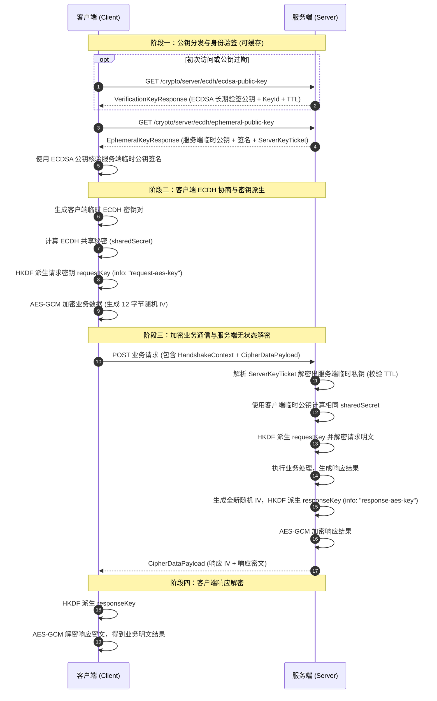

# EncryptPii - 应用层端到端数据加解密方案

[](https://www.oracle.com/java/)
[](https://spring.io/projects/spring-boot)
[](#)

本项目提供了一套面向金融、电商及隐私合规场景的应用层端到端（End-to-End）数据加解密通信参考实现。主要用于保护用户的 PII（Personally Identifiable Information，如手机号、身份证号、银行卡号等）敏感资产。

---

## 一、核心设计原则与安全架构

在移动端 App / 小程序与服务端通信场景中，**绝对禁止在客户端硬编码对称密钥或在网络中明文传输对称密钥**。本项目采用**混合加密（Hybrid Encryption）**体系，在传输层 TLS/HTTPS 之上叠加应用层防护。

### 1. 为什么需要应用层加密？
- **防御 TLS 被中间人解密（MITM）**：防范用户手机端被恶意安装根证书、抓包代理或公共 Wi-Fi 劫持解密传输数据。
- **保护核心敏感字段**：即使接口层遭遇全链路日志审计、网关解析或反向代理，也能保证核心 PII 字段始终以密文呈现。

### 2. 核心安全机制
- **一次一密与前向保密性（PFS - Perfect Forward Secrecy）**：每次会话双方使用一次性临时密钥对（Ephemeral Key Pair），即使服务端的长期密钥意外泄漏，攻击者也无法解密历史抓包密文。
- **防中间人篡改（ECDSA 身份认证）**：服务端下发的临时 ECDH 公钥使用其长期静态 ECDSA 私钥签名，客户端利用根公钥（或带缓存的验签接口）核验签名，杜绝裸 ECDH 遭遇公钥替换攻击。
- **服务端完全无状态设计（Stateless Ticket）**：服务端生成的临时私钥不存本地内存，也不强依赖 Redis/Session 存储；而是使用服务端主密钥（Master Key）打包加密成有时效的 `serverKeyTicket` 下发给客户端并随请求回传，天然支持集群弹性伸缩与无缝负载均衡。
- **单向密钥隔离（Directional Key Isolation）**：通过 HKDF 密钥派生算法，将请求加密密钥（`request-aes-key`）与响应加密密钥（`response-aes-key`）严格隔离，配合每次独立的随机 IV，杜绝密钥复用与重放风险。

### 3. 密码学算法与标准选型

| 环节 | 推荐/采用算法 | 规范与参数 | 说明 |
|---|---|---|---|
| 密钥协商 | **ECDH** | `secp256r1` (NIST P-256) | 每次请求生成临时密钥对，协商共享秘密 |
| 身份防伪与验签 | **ECDSA** | `SHA256withECDSA` | 服务端长期静态签名密钥对，抗中间人攻击 |
| 密钥派生 | **HKDF** | `HmacSHA256` | 派生出方向隔离的 256-bit AES 会话密钥 |
| 数据对称加密 | **AES-GCM** | `AES/GCM/NoPadding` (256-bit) | 认证加密，12-byte 随机 IV，128-bit Tag 防篡改 |
| 无状态票据加密 | **AES-GCM** | `AES/GCM/NoPadding` | 主密钥加密临时私钥+过期时间戳 (默认 TTL: 5min) |

---

## 二、通信流程与交互时序

完整通信分为三个阶段：**公钥与票据获取 -> 密钥协商与派生 -> 加密业务通信**。



---

## 三、通信传输与核心字段对照全景

客户端与服务端之间的网络传输结构严格类型化定义，下表汇总了各场景下传输的字段、位置及含义：

### 1. 核心传输载荷与字段对照表

| 交互阶段 / 场景 | 方向 | 传输载体 / 模型 | 字段名称 | 字段类型 | 说明 |
|---|---|---|---|---|---|
| **验签公钥获取** | Server -> Client | Body: `VerificationKeyResponse` | `publicKeyBase64`<br>`keyId`<br>`expiresAtEpochMillis` | String<br>String<br>long | 服务端长期静态 ECDSA 验签公钥（X.509 Base64 编码）、公钥版本标识与过期时间戳（支持客户端内存缓存）。 |
| **临时公钥与票据获取** | Server -> Client | Body: `EphemeralKeyResponse` | `ephemeralPublicKeyBase64`<br>`signatureAlgorithm`<br>`signatureBase64`<br>`serverKeyTicketBase64` | String<br>String<br>String<br>String | 服务端一次性 ECDH 临时公钥、签名算法名称（`SHA256withECDSA`）、临时公钥防伪签名，以及加密的无状态票据 Ticket。 |
| **双向加密通信**<br>(Bidirectional) | Client -> Server | Body: `CipherRequestPayload` | `handshakeContext`:<br>  - `clientEphemeralPublicKeyBase64`<br>  - `serverKeyTicketBase64`<br>`cipherDataPayload`:<br>  - `ivBase64`<br>  - `encryptedDataBase64` | Object<br>String<br>String<br>Object<br>String<br>String | 客户端临时公钥、服务端票据；业务数据由客户端派生的 `requestKey` 经 AES-256-GCM 加密后的 12 字节随机 IV 与 Base64 密文。 |
|  | Server -> Client | Body: `CipherDataPayload` | `ivBase64`<br>`encryptedDataBase64` | String<br>String | 服务端使用独立派生的 `responseKey` 加密生成的响应 12 字节随机 IV 与密文。 |
| **仅请求加密**<br>(Request-Only) | Client -> Server | Body: `CipherRequestPayload` | 与双向加密请求体完全一致 | Object | 客户端发送加密业务报文。 |
|  | Server -> Client | Body: `PlainData` | `data` | String | 服务端返回明文业务 JSON。 |
| **仅响应加密**<br>(Response-Only) | Client -> Server | Body: `PlainRequestPayload` | `handshakeContext`:<br>  - `clientEphemeralPublicKeyBase64`<br>  - `serverKeyTicketBase64`<br>`data` | Object<br>String<br>String<br>String | 请求体带明文数据，同时附带客户端临时公钥和 Ticket，供服务端协商密钥加密响应。 |
|  | Server -> Client | Body: `CipherDataPayload` | `ivBase64`<br>`encryptedDataBase64` | String<br>String | 服务端返回加密的响应体。 |

### 2. 绝不在网络传输的本地敏感字段

在安全设计中，以下敏感字段仅在单侧内存或本地安全存储中保存，**绝不通过网络明文传输**：
- **客户端本地私有**：
  - `clientEphemeralPrivateKey`：客户端临时 ECDH 私钥（仅保存在客户端内存 `CryptoRequestContext`，会话结束后废弃）。
  - `sharedSecret`：ECDH 协商原始共享秘密。
  - `requestAesKey` / `responseAesKey`：HKDF 派生的会话对称密钥。
- **服务端本地私有**：
  - `ecdsa-private-key.pkcs8`：服务端长期静态 ECDSA 签名私钥（严格保存在服务器安全路径或 KMS 中）。
  - `ecdh-ticket-master-key.aes`：服务端无状态票据加密主密钥（用于 AES-GCM 加密和解包 `serverKeyTicket`）。
  - `CryptoSessionContext`：服务端线程上下文（请求周期内临时持有计算出的 `sharedSecret`，响应加密完成后即刻清理）。

---

## 四、工程模块结构

```text
EncryptPii/
├── common/                    # 基础通用模块
│   └── src/main/java/com/ikea/crypto/common/
│       ├── constant/          # 密码学常量 (CryptoConstants)
│       ├── crypto/            # 核心加密库 (AesGcmCipher, KeyAgreementService, KeyPairFactory, HKDF)
│       ├── model/             # 统一网络传输 DTO (Payload、Ticket、KeyResponse)
│       └── util/              # 编码工具 (EncodingUtils, HkdfUtils)
├── server/                    # 服务端微服务 (默认端口: 9090)
│   └── src/main/java/com/ikea/crypto/server/
│       ├── advice/            # AOP切面: @DecryptRequest (统一解密), @EncryptResponse (统一加密)
│       ├── api/               # 服务端 Controller (握手接口、双向/单向通信演示接口)
│       ├── context/           # 请求线程上下文 (CryptoSessionContextAccessor)
│       └── service/           # 无状态加解密服务核心 (CryptoServer: 票据解包/打包、签名)
├── client/                    # 客户端 SDK / 代理端点 (默认端口: 8080)
│   └── src/main/java/com/ikea/crypto/client/
│       ├── api/               # 客户端代理 Controller (对外接收业务明文测试请求)
│       ├── core/              # CryptoClient (纯密码学协商核心) + CryptoHttpClient (HTTP通信及公钥缓存)
│       └── model/             # 客户端本地上下文 (CryptoRequestContext)
└── docs/                      # 架构文档与历史设计备忘
```

---

## 五、快速启动与接口验证

### 1. 环境准备
- Java 17+
- Gradle 8.x / 9.x (项目自带 `gradlew` wrapper)

### 2. 编译并运行所有单元测试
```bash
./gradlew test
```
测试用例全面覆盖：
- 完整双向加密流程与解密验证 (`CryptoServerIntegrationTest`)
- 请求与响应密钥单向隔离验证 (`DirectionalKeyIsolationTest`, `DirectionalCryptoClientTest`)
- 篡改 Ticket / 伪造签名拦截验证

### 3. 启动服务
分别打开两个终端窗口启动服务端与客户端：

```bash
# 启动服务端 (监听 9090 端口)
./gradlew server:bootRun

# 启动客户端 (监听 8080 端口)
./gradlew client:bootRun
```

### 4. 接口验证命令 (cURL)

可以通过请求客户端代理接口，完整观察“客户端拉取公钥 -> 签名校验 -> 密钥协商 -> AES 加密请求 -> 服务端解密 -> 服务端加密响应 -> 客户端解密响应”的全链路交互：

#### ① 双向加密调用 (Bidirectional)
```bash
curl -X POST http://localhost:8080/crypto/client/ecdh/bidirectional \
  -H "Content-Type: application/json" \
  -d '{"request":"Hello, Secure World!"}'
```
*响应结果示例（包含客户端发送的密文结构与解密后的明文响应）：*
```json
{
  "request": {
    "data": "Hello, Secure World!",
    "encrypted": {
      "handshakeContext": {
        "clientEphemeralPublicKeyBase64": "MFkwEwYHKoZIzj0CAQYIKoZIzj0DAQcDQgAE...",
        "serverKeyTicketBase64": "4o2G8sXv..."
      },
      "cipherDataPayload": {
        "ivBase64": "vI32...",
        "encryptedDataBase64": "T/8s..."
      }
    }
  },
  "response": {
    "data": "mock ecdh response for request - Hello, Secure World!}",
    "encrypted": {
      "ivBase64": "e3T...",
      "encryptedDataBase64": "p59..."
    }
  }
}
```

#### ② 仅请求加密调用 (Request-Only)
```bash
curl -X POST http://localhost:8080/crypto/client/ecdh/request-only \
  -H "Content-Type: application/json" \
  -d '{"request":"Sensitive Request Payload"}'
```

#### ③ 仅响应加密调用 (Response-Only)
```bash
curl -X POST http://localhost:8080/crypto/client/ecdh/response-only \
  -H "Content-Type: application/json" \
  -d '{"request":"Plain Query Params"}'
```

---

## 六、生产落地最佳实践与安全合规建议

1. **服务端密钥保管**：在生产环境中，静态 ECDSA 签名私钥及 Ticket 主密钥应妥善存储于云厂商硬件安全模块（HSM）或密钥管理系统（如 AWS KMS、阿里云 KMS、HashiCorp Vault）中，避免直接明文落盘。
2. **客户端公钥管理**：将服务端长期静态 ECDSA 根公钥硬编码或安全注入到客户端安装包中；每次握手动态获取临时公钥时强制核验签名，防范中间人代理攻击。
3. **避免密钥在客户端持久化**：客户端派生出的会话对称密钥与临时私钥仅保留在内存中，随用随走，切忌存入 `localStorage`、Cookie 或永久文件系统中。
4. **日志安全脱敏**：在服务端网关及业务代码中，禁止在打印的日志中输出已解密的明文手机号、身份证等敏感字段以及原始 `sharedSecret`。
